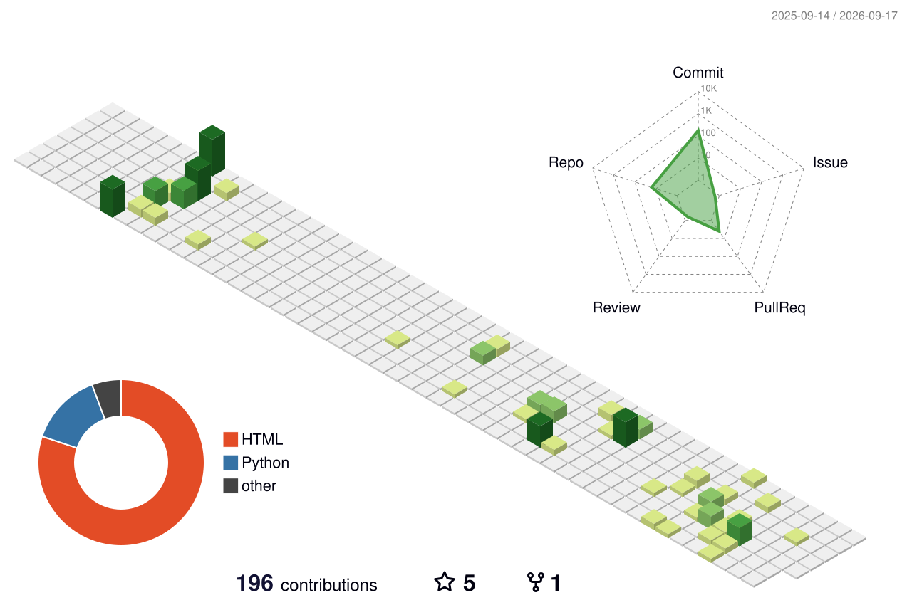

## Brief Introduction

- 👋 Hi, I'm **@dreamer198**.
- 🏫 I'm currently at **Wuhan University** in Wuhan, China.
- 🚁 I focus on **UAV autonomy, motion planning, and simulation-to-real systems**.
- 🧠 I'm also interested in **learning-based navigation, world models, and embodied intelligence**.
- 🛠️ I build reproducible **ROS/PX4** workflows and maintain [UAV Autonomy All-in-One](https://github.com/dreamer198/UAV-Autonomy-All-in-One) and [Awesome UAV Planning](https://github.com/dreamer198/awesome-uav-planning).
- 💬 Feel free to connect with me about UAV planning, robotics, or reproducible research.
- 🌐 [Homepage](https://dreamer198.top/about/) · [ORCID](https://orcid.org/0009-0005-8349-9904)

  
  
  
  
  
  

### Contributions Calendar

  

